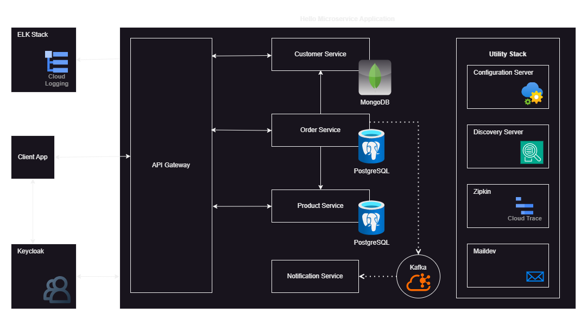

# Hello Microservice

A simple project that demonstrates how to build a microservice application with Spring Boot and Spring Cloud.

## Architecture

The project has the following modules:

* **Configuration server** : provides configuration properties to other modules.
* **Eureka discovery server**: allows microservices to dynamically discover each other.
* **Notification service**: listens for events pushed on a Kafka topic and sends emails in response to them.
* **Customer service**: manages customers stored as documents in a MongoDB collection.
* **Product service**: manages products, product categories and product images stored in a PostgreSQL database.
* **Order service**: manages orders. Interacts with the customer and product services. Pushes events in a Kafka topic to notify customers about their orders.
* **API Gateway**: provides access to all services from a single host.

## Resources

The microservices interact with servers deployed as docker containers.
Those are:

* **PostgreSQL** and **PgAdmin 4**: A relational database management system (RDBMS) with a web based administration and query tool.
* **MongoDB** with **Mongo Express**: A document based no-sql database management system with a web based administration and query tool.
* **Apache Kafka** with **Kafka UI**: A message broker with a web based administration tool.
* **Zipkin**: A web requests tracing system.
* **Maildev**: A mail faker, it doesn't send mails but rather store them for local consultation.

_docker-compose.yml_ files and launch scripts are provided for each server in the _containers_ subdirectory.

## Configuration

The configuration files are stored in a local git repository: [hello-microservice-configuration](https://github.com/michelmbem/hello-microservice-configuration). 
The _config-server_ module should be running before building any other module. 
The order of build is as follows:

1. config-server (launch it before moving forward)
2. discovery-server
3. notification-service
4. customer-service
5. product-service
6. order-service
7. api-gateway
