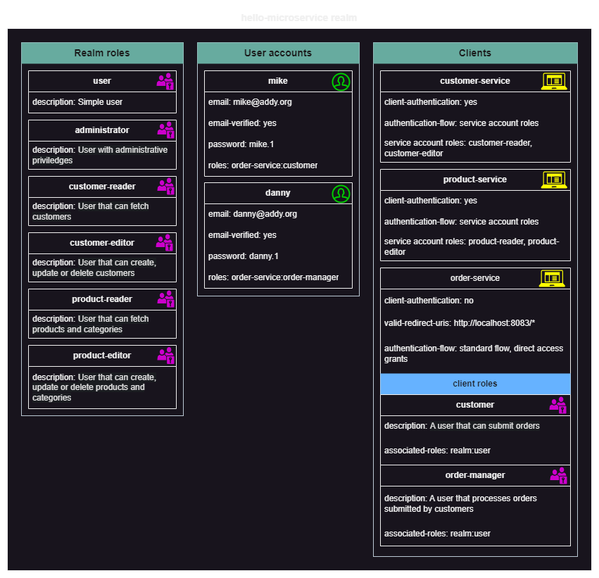

# Hello Microservice

A simple project that demonstrates how to create a microservices application with Spring Boot and Spring Cloud.

## Architecture

The project includes the following modules:

* **Configuration Server**: Provides configuration properties to other modules.
* **Eureka Discovery Server**: Allows microservices to dynamically discover each other and also acts as a load balancer.
* **Notification Service**: Listens for events sent to a Kafka topic and sends emails in response.
* **Customer Service**: Manages a repository of customers stored as documents in a MongoDB collection.
* **Product Service**: Manages products, product categories, and product images stored in a PostgreSQL database.
* **Order Service**: Manages orders. Interacts with the Customer and Product services. Sends events to a Kafka topic to notify customers of the receipt or update of their orders.
* **API Gateway**: Allows access to all services from a single host.

## Libraries

The project contains a set of small libraries that provide the definitions of functionalities that may be shared by other modules.
All of them are grouped in the *libraries* subdirectory. These are:

* **Core Library**: core utility classes and interfaces.
* **Security Library**: security related reusable classes and interfaces.

## Resources

Microservices interact with servers deployed in Docker containers.
These are:

* **PostgreSQL** and **PgAdmin 4**: A relational database management system (RDBMS) with a web-based administration and query interface.
* **MongoDB** with **Mongo Express**: A document-based, no-SQL database management system (DBMS) with a web-based administration and query interface.
* **Apache Kafka** with **Kafka UI**: A message broker with a web-based administration interface.
* **Zipkin**: A web request tracing system.
* **Maildev**: A fake SMTP server that doesn't forward the mails it receives from its clients but stores them for local viewing.
* **Keycloak**: An open-source identity and access management solution that allows for adding authentication and authorization support to microservices with little difficulty.
* **ELK**: A tool stack comprising an **Elasticsearch** cluster, **Logstash**, and **Kibana**. Elasticsearch (ES) is a no-SQL DBMS with powerful indexing capabilities.
  Kibana is a frontend for ES. Logstash acts as a pipeline that streams log messages from any source to ES. Together, these tools provide applications with a centralized, online-accessible logging platform.

Notes:

1. *docker-compose.yml* files and launch scripts are provided for each server in the *containers* subdirectory of the project directory.
2. You should normally recreate the *hello-microservice* Keycloak realm used in this project. Its structure is shown in the diagram below.
However, the keycloak container is shared with its data volume, which will automatically restore the realm I used for testing.

## Keycloak Extension

The **Keycloak Providers** module is a Keycloak extension that allows you to use the **Customer Service** database as user storage.
Using this extension is optional. However, to test this functionality, follow these steps:

1. Delete your running Keycloak container.
2. In your *keycloak-providers/build.gradle* file, verify that the *keycloakProvidersDir* parameter points to the correct location of your Keycloak container's *providers* volume.
3. Run the **shadowJar** Gradle task: this will generate a fat jar file for the module and automatically copy it to the directory pointed to by *keycloakProvidersDir*.
4. Rerun your Keycloak container.
5. Open your Keycloak realm admin page in the browser and navigate to the **User Federation** section of the realm settings.
Enable the *Hello Microservice Customers* provider. Then go to the **Users** page and verify that your *Customers* are really displayed.

## Configuration

The configuration files are stored in a local Git repository: [hello-microservice-configuration](https://github.com/michelmbem/hello-microservice-configuration). 
The *config-server* and *discovery-server* modules must be run before building any microservice. 
The build order is as follows:

1. libraries
2. config-server (run it before continuing)
3. discovery-server (also run it before continuing)
4. notification-service
5. customer-service
6. product-service
7. order-service
8. api-gateway